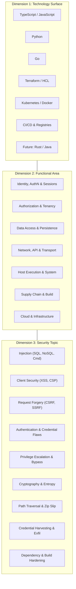

# Airtight Coverage Matrix & Security Roadmap

> **Status:** Architecture Plan & Coverage Specification  
> **Target Version Alignment:** Airtight v0.3.0 (Current) → v0.4.0+ (Roadmap)  
> **Location:** `docs/plans/coverage-matrix-roadmap.md`

This document defines the multidimensional security coverage model for Airtight. It maps security coverage across three orthogonal axes:
1. **Language & Technology Surface** (TypeScript/JavaScript, Python, Go, Terraform, Kubernetes, Containers, CI/CD)
2. **Functional Architecture Area** (Identity & Auth, Authorization & Tenancy, Data Persistence, Network & API, Host Execution, Supply Chain, Cloud Infrastructure)
3. **Security Topic & Vulnerability Class** (Injection, XSS, CSRF/SSRF, Credential Exfiltration, Deserialization, Broken Access Control, Weak Cryptography, etc.)

It serves both as an **exhaustive audit of what is already completed** in Airtight's 129 deterministic rules and dual-subagent review layer, and as a **strategic roadmap** for future engine rules and model playbooks.

---

## The Three Dimensions



### Legend & Status Indicators

- **`[DONE - Engine]`**: Implemented as a deterministic rule in `engine/rules/*.yaml` (with true-positive and pass-corpus test fixtures).
- **`[DONE - Model]`**: Explicitly covered by `/airtight review`, `/airtight threat-model`, or `/airtight audit` playbooks (requiring semantic reasoning, reachability analysis, or authorization logic).
- **`[PLANNED - Engine]`**: Candidate for a deterministic engine rule in an upcoming release.
- **`[PLANNED - Model]`**: Candidate for specialized model evaluation heuristics or verifier subagent prompts.
- **`[N/A]`**: Not applicable to this technology or execution context.

---

## 2D Matrix Views (Grouped by Functional Area)

### 1. Identity, Authentication & Session Management

| Security Topic / Threat | TypeScript / JavaScript | Python | Go | Cloud / IaC / K8s |
|---|---|---|---|---|
| **Password Hashing** | `[DONE - Engine]`<br>`js/weak-password-hash` (MD5/SHA) | `[DONE - Engine]`<br>`py/weak-password-hash` (MD5/SHA) | `[DONE - Engine]`<br>`go/weak-password-hash` (crypto/md5 or sha1 for pwd) | `[N/A]` |
| **Session Cookie Flags** | `[DONE - Engine]`<br>`js/cookie-insecure`<br>`js/cookie-missing-httponly`<br>`js/cookie-samesite-none` | `[DONE - Engine]`<br>`py/cookie-missing-httponly`<br>`py/cookie-insecure` | `[DONE - Engine]`<br>`go/cookie-flags`<br>*(Also `java/cookie-missing-httponly`)* | `[N/A]` |
| **JWT Verification & Algorithms** | `[DONE - Engine]`<br>`js/jwt-algorithm-none`<br>`js/jwt-verify-without-algorithms`<br>`js/jwt-decode-unverified` | `[DONE - Engine]`<br>`py/jwt-algorithm-none`<br>`py/jwt-decode-unverified` | `[DONE - Engine]`<br>`go/jwt-algorithm-none` (golang-jwt parser)<br>*(Also `java/jwt-algorithm-none`)* | `[N/A]` |
| **Insecure Randomness for Tokens** | `[DONE - Engine]`<br>`js/math-random-for-secret` (Math.random) | `[DONE - Engine]`<br>`py/random-for-secret` (random.* for token/secret) | `[DONE - Engine]`<br>`go/math-rand-for-secret` (math/rand vs crypto/rand)<br>*(Also `java/insecure-random`, `rust/weak-rng`)* | `[N/A]` |
| **Unauthenticated Service Endpoints** | `[DONE - Model]`<br>Route reachability audit | `[DONE - Model]`<br>Route reachability audit | `[DONE - Model]`<br>Handler reachability audit | `[DONE - Engine]`<br>`k8s/anonymous-subject-binding`<br>`terraform/rds-publicly-accessible` |
| **Hardcoded Tokens & Keys** | `[DONE - Engine]`<br>`secret/*` (15 provider formats) | `[DONE - Engine]`<br>`secret/*` (15 provider formats) | `[DONE - Engine]`<br>`secret/*` (15 provider formats) | `[DONE - Engine]`<br>`terraform/hardcoded-credential`<br>`k8s/secret-in-env-literal` |
| **Credential File Harvesting** | `[DONE - Engine]`<br>`js/steal-credential-file` (.ssh, .aws, .kube) | `[DONE - Engine]`<br>`py/steal-credential-file` (.ssh, .aws, .kube) | `[DONE - Engine]`<br>`go/steal-credential-file` (.ssh, .aws, .kube) | `[DONE - Engine]`<br>`container/ssh-key-copied` |
| **Environment Credential Exfiltration** | `[DONE - Engine]`<br>`js/env-exfiltration` (dumping process.env) | `[DONE - Engine]`<br>`py/env-exfiltration` (dumping os.environ) | `[DONE - Engine]`<br>`go/env-exfiltration` (dumping os.Environ) | `[DONE - Engine]`<br>`ci/secret-echoed-to-log` |

---

### 2. Access Control, Authorization & Tenancy

| Security Topic / Threat | TypeScript / JavaScript | Python | Go | Cloud / IaC / K8s |
|---|---|---|---|---|
| **Authorization Check Implementation** | `[DONE - Model]`<br>Dual-subagent review | `[DONE - Engine]`<br>`py/assert-for-authorization` (assert user.is_admin) | `[DONE - Model]`<br>Dual-subagent review | `[DONE - Engine]`<br>`k8s/cluster-admin-binding`<br>`terraform/iam-wildcard-action` |
| **Multi-Tenant Scoping / IDOR** | `[DONE - Model]`<br>Tenant ID boundary verification | `[DONE - Model]`<br>Tenant ID boundary verification | `[DONE - Model]`<br>Tenant ID boundary verification | `[DONE - Engine]`<br>`terraform/iam-wildcard-resource`<br>`terraform/sqs-sns-public-policy` |
| **CSRF Protection** | `[DONE - Engine]`<br>`js/express-csrf-missing` (state-changing methods) | `[DONE - Engine]`<br>`py/csrf-exempt` (@csrf_exempt decorator) | `[PLANNED - Engine]`<br>`go/csrf-middleware-missing`<br>*(Java: `java/spring-csrf-disabled` [DONE])* | `[N/A]` |
| **CORS Misconfiguration** | `[DONE - Engine]`<br>`js/cors-wildcard-with-credentials` | `[DONE - Engine]`<br>`py/cors-wildcard` (origins='*' or allow-all) | `[DONE - Engine]`<br>`go/cors-wildcard` (rs/cors AllowAll or wildcard)<br>*(Java: `java/cors-wildcard` [DONE])* | `[N/A]` |
| **Privilege Escalation in Workloads** | `[N/A]` | `[N/A]` | `[N/A]` | `[DONE - Engine]`<br>`container/runs-as-root`<br>`container/explicit-root-user`<br>`k8s/allow-privilege-escalation`<br>`k8s/privileged-container`<br>`k8s/dangerous-capabilities` |
| **Namespace & Isolation Breakout** | `[N/A]` | `[N/A]` | `[N/A]` | `[DONE - Engine]`<br>`k8s/host-namespace`<br>`k8s/docker-socket-mount`<br>`k8s/default-namespace`<br>`container/sudo-in-image` |
| **CI Token & Permission Scope** | `[N/A]` | `[N/A]` | `[N/A]` | `[DONE - Engine]`<br>`ci/no-explicit-permissions`<br>`ci/write-all-permissions` |

---

### 3. Data Access, Storage & Persistence

| Security Topic / Threat | TypeScript / JavaScript | Python | Go | Cloud / IaC / K8s |
|---|---|---|---|---|
| **SQL & Directory Injection** | `[DONE - Engine]`<br>`js/sql-string-concat`<br>`js/sql-template-interpolation` | `[DONE - Engine]`<br>`py/sql-fstring`<br>`py/sql-percent-format` | `[DONE - Engine]`<br>`go/sql-string-concat` (db.Query with fmt.Sprintf or +)<br>*(Also `rust/sql-format`, `java/sql-concatenation`, `java/ldap-injection`)* | `[N/A]` |
| **NoSQL Injection (Operator & Selector)** | `[DONE - Engine]`<br>`js/nosql-injection` ($where, req.body to find) | `[DONE - Engine]`<br>`py/nosql-injection` ($where operator evaluation) | `[PLANNED - Engine]`<br>`go/nosql-injection` (bson.M injection) | `[N/A]` |
| **Database Encryption at Rest** | `[N/A]` | `[N/A]` | `[N/A]` | `[DONE - Engine]`<br>`terraform/rds-unencrypted`<br>`terraform/ebs-unencrypted` |
| **State Storage & Bucket Encryption** | `[N/A]` | `[N/A]` | `[N/A]` | `[DONE - Engine]`<br>`terraform/unencrypted-state-backend`<br>`terraform/s3-public-access-block-disabled`<br>`terraform/s3-public-acl` |
| **Cryptographic Storage & Key Rotation** | `[DONE - Engine]`<br>`js/deprecated-cipher-api` (EVP_BytesToKey) | `[DONE - Engine]`<br>`py/insecure-cipher` (DES/RC4/ECB mode) | `[DONE - Engine]`<br>`go/insecure-cipher` (DES/RC4)<br>*(Also `java/insecure-cipher`)* | `[DONE - Engine]`<br>`terraform/kms-rotation-disabled` |

---

### 4. API, Network & Transport Communication

| Security Topic / Threat | TypeScript / JavaScript | Python | Go | Cloud / IaC / K8s |
|---|---|---|---|---|
| **SSRF (Server-Side Request Forgery)** | `[DONE - Engine]`<br>`js/ssrf-request-from-input` (fetch/axios from req) | `[DONE - Engine]`<br>`py/ssrf-from-input` (requests from input) | `[DONE - Engine]`<br>`go/ssrf-from-input` (http.Get/Post from input)<br>*(Also `java/ssrf-from-input`)* | `[DONE - Engine]`<br>`terraform/imdsv1-allowed` (IMDSv1 permits SSRF theft) |
| **TLS Certificate Verification Disabled** | `[DONE - Engine]`<br>`js/tls-verification-disabled` (rejectUnauthorized: false) | `[DONE - Engine]`<br>`py/requests-verify-false`<br>`py/cert-reqs-none`<br>`py/ssl-wrap-socket-deprecated`<br>`py/paramiko-missing-host-key-policy` | `[DONE - Engine]`<br>`go/tls-insecure-skip-verify` (InsecureSkipVerify: true)<br>*(Also `java/trust-all-certs`, `rust/tls-insecure-skip-verify`)* | `[N/A]` |
| **Plaintext Transport & Insecure HTTP** | `[DONE - Engine]`<br>`dep/http-registry`<br>`dep/lockfile-http-resolved` | `[DONE - Engine]`<br>`dep/pip-index-http`<br>`dep/pip-trusted-host` | `[PLANNED - Engine]`<br>`go/http-serve-insecure` | `[DONE - Engine]`<br>`terraform/lb-http-listener`<br>`terraform/weak-tls-policy` |
| **Network Ingress & Exposure** | `[N/A]` | `[DONE - Engine]`<br>`py/bind-all-interfaces` (host=0.0.0.0) | `[DONE - Engine]`<br>`go/bind-all-interfaces` (net.Listen / ListenAndServe 0.0.0.0) | `[DONE - Engine]`<br>`terraform/open-ingress`<br>`terraform/open-ingress-sensitive-port`<br>`k8s/nodeport-service` |
| **Open Redirect** | `[DONE - Engine]`<br>`js/open-redirect` (res.redirect(req.query.url)) | `[DONE - Engine]`<br>`py/open-redirect` (redirect(request.args/GET)) | `[DONE - Engine]`<br>`go/open-redirect` (http.Redirect from query)<br>*(Also `java/open-redirect`)* | `[N/A]` |

---

### 5. Input Validation, Dynamic Evaluation & Client Security

| Security Topic / Threat | TypeScript / JavaScript | Python | Go | Cloud / IaC / K8s |
|---|---|---|---|---|
| **Dynamic Code Execution (Eval)** | `[DONE - Engine]`<br>`js/eval-dynamic` (eval, new Function) | `[DONE - Engine]`<br>`py/eval-exec` (eval, exec) | `[N/A]` | `[N/A]` |
| **Cross-Site Scripting (XSS)** | `[DONE - Engine]`<br>`js/dangerously-set-inner-html`<br>`js/inner-html-assignment` | `[DONE - Engine]`<br>`py/jinja-autoescape-off` (autoescape=False) | `[DONE - Engine]`<br>`go/html-template-unescaped` (template.HTML/JS) | `[N/A]` |
| **XML External Entity (XXE)** | `[DONE - Engine]`<br>`js/xxe-libxml` (noent: true) | `[DONE - Engine]`<br>`py/xxe-unsafe-parser` (xml.etree entity expansion) | `[DONE - Engine]`<br>`go/xxe-xml-decoder`<br>*(Also `java/xxe-parser`)* | `[N/A]` |
| **Insecure Deserialization** | `[DONE - Engine]`<br>`js/node-serialize` | `[DONE - Engine]`<br>`py/pickle-loads`<br>`py/yaml-unsafe-load` | `[PLANNED - Engine]`<br>`go/gob-untrusted-decoder`<br>*(Also `java/insecure-deserialization`)* | `[N/A]` |
| **Regular Expression Denial of Service** | `[DONE - Engine]`<br>`js/regexp-from-input` (new RegExp from req) | `[DONE - Engine]`<br>`py/re-compile-from-input` (re.compile from input) | `[N/A]` (Go uses RE2 linear-time) | `[N/A]` |
| **Payload Limits & DoS Controls** | `[DONE - Engine]`<br>`js/express-body-parser-large-limit` (>500mb limit) | `[PLANNED - Engine]`<br>`py/large-payload-limit` | `[PLANNED - Engine]`<br>`go/max-bytes-reader-missing` | `[N/A]` |
| **Prototype Pollution** | `[DONE - Engine]`<br>`js/prototype-pollution` (recursive merge/deep copy) | `[N/A]` | `[N/A]` | `[N/A]` |

---

### 6. Execution Environment & System Calls

| Security Topic / Threat | TypeScript / JavaScript | Python | Go | Cloud / IaC / K8s |
|---|---|---|---|---|
| **Command Injection (Shell Spawning)** | `[DONE - Engine]`<br>`js/child-process-interpolation`<br>`js/spawn-shell-true` | `[DONE - Engine]`<br>`py/os-system-interpolation`<br>`py/subprocess-shell-true` | `[DONE - Engine]`<br>`go/command-exec-shell` (exec.Command with sh/bash -c)<br>*(Also Java: `java/command-exec`, Rust: `rust/command-injection`)* | `[DONE - Engine]`<br>`ci/script-injection` (interpolating ${{ github.event }} into shell) |
| **Pipe to Shell Execution** | `[DONE - Engine]`<br>`dep/curl-pipe-shell-script` | `[N/A]` | `[N/A]` | `[DONE - Engine]`<br>`container/curl-pipe-shell` (RUN curl \| sh) |
| **Path Traversal & Zip Slip** | `[DONE - Engine]`<br>`js/path-join-from-input` (path.join with req) | `[DONE - Engine]`<br>`py/tarfile-extractall`<br>`py/zipfile-extractall` | `[DONE - Engine]`<br>`go/zip-slip` (filepath.Join without clean/prefix check)<br>*(Also `rust/path-traversal`, `java/path-traversal`)* | `[DONE - Engine]`<br>`k8s/host-path-volume` (mounting host directories) |
| **Insecure Temporary File Creation** | `[PLANNED - Engine]`<br>`js/temp-file-predictable` (/tmp/ hardcoding) | `[DONE - Engine]`<br>`py/tempfile-mktemp` (mktemp race condition) | `[DONE - Engine]`<br>`go/tempfile-insecure`<br>*(Also `rust/tempfile-insecure`)* | `[N/A]` |
| **Debug Mode Left Active** | `[PLANNED - Engine]`<br>`js/express-stacktrace` | `[DONE - Engine]`<br>`py/flask-debug-enabled` (debug=True / DEBUG=True) | `[DONE - Engine]`<br>`go/gin-debug-mode` (gin.SetMode debug) | `[N/A]` |
| **Filesystem Permissions** | `[N/A]` | `[N/A]` | `[N/A]` | `[DONE - Engine]`<br>`container/world-writable-chmod`<br>`k8s/writable-root-filesystem` |

---

### 7. Supply Chain, Dependencies & Build Integrity

| Security Topic / Threat | TypeScript / JavaScript | Python | Go | CI/CD Infrastructure |
|---|---|---|---|---|
| **Unpinned Dependency Ranges** | `[DONE - Engine]`<br>`dep/wildcard-version` (package.json "*") | `[DONE - Engine]`<br>`dep/pip-unpinned` (requirements.txt unconstrained) | `[PLANNED - Engine]`<br>`go/mod-unpinned-pseudo` | `[DONE - Engine]`<br>`container/latest-tag`<br>`container/unpinned-digest`<br>`k8s/latest-image-tag`<br>`k8s/untagged-image` |
| **Unpinned Git References** | `[DONE - Engine]`<br>`dep/git-dependency-unpinned` (branch url) | `[PLANNED - Engine]`<br>`py/git-dependency-unpinned` (git+https without SHA) | `[PLANNED - Engine]`<br>`go/git-dependency-unpinned` | `[DONE - Engine]`<br>`ci/unpinned-third-party-action` (@v3 mutable ref) |
| **Untrusted CI Checkout Triggers** | `[N/A]` | `[N/A]` | `[N/A]` | `[DONE - Engine]`<br>`ci/pull-request-target-checkout`<br>`ci/workflow-run-checkout` |
| **Self-Hosted Runner Security** | `[N/A]` | `[N/A]` | `[N/A]` | `[DONE - Engine]`<br>`ci/self-hosted-runner` (runs-on: self-hosted) |
| **Install Lifecycle Scripts** | `[DONE - Engine]`<br>`dep/install-script` (postinstall scripts) | `[PLANNED - Engine]`<br>`py/setup-exec-arbitrary` (setup.py custom commands) | `[N/A]` (Go build does not run arbitrary install scripts) | `[N/A]` |
| **Dependency Auditing Suppressed** | `[DONE - Engine]`<br>`dep/npm-audit-disabled` (audit=false) | `[PLANNED - Engine]`<br>`py/pip-audit-disabled` | `[PLANNED - Engine]`<br>`go/govulncheck-omitted` | `[N/A]` |
| **Local Module Replacement / Overrides** | `[PLANNED - Engine]`<br>`js/npm-link-in-repo` | `[PLANNED - Engine]`<br>`py/pip-editable-in-prod` | `[DONE - Engine]`<br>`dep/go-replace-local-path` (replace => ./local) | `[N/A]` |
| **Committed Registry Tokens** | `[DONE - Engine]`<br>`dep/npm-auth-token-committed` (.npmrc token) | `[PLANNED - Engine]`<br>`py/pypirc-token-committed` (.pypirc token) | `[PLANNED - Engine]`<br>`go/netrc-token-committed` | `[DONE - Engine]`<br>`container/secret-in-build-arg` |

---

## Current State Audit (191 Rules)

```
Pack Breakdown:
  ci:         8 rules  [supply-chain]
  container: 10 rules  [containers]
  dep:       12 rules  [supply-chain]
  go:        19 rules  [appsec, secrets, infrastructure]
  java:      18 rules  [appsec, secrets]
  js:        29 rules  [appsec, secrets]
  k8s:       18 rules  [containers, infrastructure]
  py:        34 rules  [appsec, secrets, infrastructure]
  rust:       8 rules  [appsec, secrets]
  secret:    15 rules  [secrets]
  terraform: 20 rules  [infrastructure]

Immediate vs Deep Tier:
  Immediate Tier (Edit-site interrupt): 131 rules (68.6%)
  Deep Tier (Full scan / Commit-time):   60 rules (31.4%)

Mechanically Checkable vs Reasoning Split:
  Secrets:              ~95% engine / 5% model
  Containers & IaC:     ~90% engine / 10% model
  Supply Chain & CI:    ~75% engine / 25% model
  Application Code:     ~70% engine / 30% model
```

---

## Strategic Roadmap

### Phase 1 (v0.3.0): Deepening Application Sinks & Core Exfiltration
- **Go Rule Expansion**:
  - `go/sql-string-concat`: Detect `fmt.Sprintf` or `+` string concatenation in `db.Query`, `db.Exec`, `db.QueryRow`.
  - `go/command-exec-shell`: Detect `exec.Command("sh", "-c", ...)` and `exec.Command("bash", "-c", ...)`.
  - `go/tls-insecure-skip-verify`: Detect `&tls.Config{InsecureSkipVerify: true}`.
  - `go/weak-password-hash`: Detect `crypto/md5` and `crypto/sha1` with password-shaped variables.
  - `go/zip-slip`: Detect `archive/zip` extracting member headers without path anchoring.
- **JavaScript & TypeScript Deepening**:
  - `js/prototype-pollution`: Detect unvalidated recursive object merges (`Object.assign` or custom merge on `__proto__` / `constructor`).
  - `js/express-csrf-missing`: Detect state-changing router endpoints without CSRF protection middleware in sessions.
  - `js/node-serialize-deserialize`: Insecure deserialization via `node-serialize` or `serialize-javascript`.
- **Python Deepening**:
  - `py/ssrf-from-input`: Outbound `requests.get` / `urllib` using unvalidated request query/path params.
  - `py/zipfile-extractall`: `zipfile.ZipFile.extractall()` without traversal checks (complementing `py/tarfile-extractall`).
  - `py/open-redirect`: `django.shortcuts.redirect` and `flask.redirect` targets from request parameters.

### Phase 2 (v0.4.0): Enterprise Ecosystem Expansion (Rust & Java)
- **Rust Pack (`rust`)**:
  - `rust/unsafe-block-misuse`: Unbounded `unsafe` blocks in public libraries.
  - `rust/command-injection`: `std::process::Command` invoked with `sh -c` and interpolated strings.
  - `rust/sql-format`: `sqlx` or `diesel` queries using `format!` instead of query bind parameters.
  - `rust/steal-credential-file`: `std::fs::read_to_string` accessing `~/.ssh` or `~/.aws/credentials`.
- **Java / JVM Pack (`java`)**:
  - `java/sql-concatenation`: JDBC `Statement.executeQuery` with string concatenation.
  - `java/command-exec`: `Runtime.getRuntime().exec` with concatenated command string.
  - `java/xxe-sax-parser`: `SAXParserFactory` or `DocumentBuilderFactory` without `FEATURE_SECURE_PROCESSING`.
  - `java/insecure-deserialization`: `ObjectInputStream.readObject()` on untrusted input streams.

### Phase 3 (v0.5.0): Infrastructure as Code & Orchestration Breadth
- **CloudFormation & AWS SAM (`cloudformation`)**:
  - Public S3 buckets, open security groups (0.0.0.0/0 on port 22/3389), unencrypted EBS volumes.
- **Docker Compose (`compose`)**:
  - Services running in `network_mode: host`, `privileged: true`, mounting `/var/run/docker.sock`.
- **Helm Charts (`helm`)**:
  - Template misconfigurations allowing wildcard RBAC or missing Pod Security Standards.

### Phase 4 (v1.0.0): Cross-Layer Correlation & Semantic Reachability
- Correlating IaC exposure with application sink:
  - If `terraform/open-ingress` exposes port 3000 to `0.0.0.0/0`, elevate application findings on port 3000 from P1 to P0.
  - If a service runs in an internal isolated container network, downgrade `py/bind-all-interfaces` from P2 to P3.
- Subagent Reachability Mapping:
  - Automated graph walking in `/airtight review` to verify whether request inputs reach dangerous sinks before reporting.
