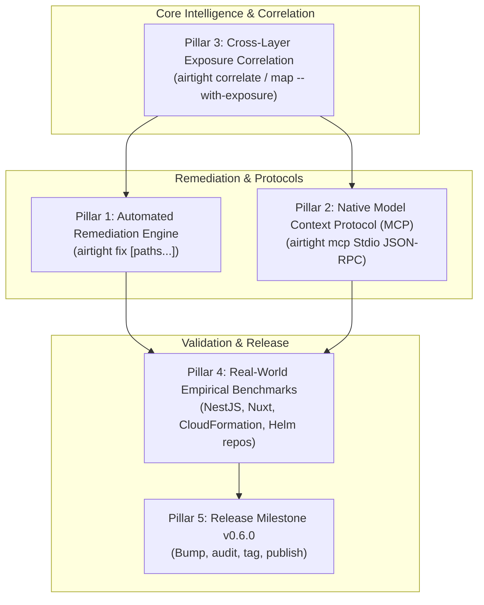

# Airtight Strategic Roadmap: Wave 7 & Beyond (v0.6.0)

> **Status:** Approved Strategic Architecture Plan  
> **Target Release:** Airtight v0.6.0  
> **Document Location:** `docs/plans/v0.6.0-roadmap.md`

Following the completion of Wave 6 (218 rules) and Wave 7 (236 rules, 16 rule packs, 667 tests), Airtight has established comprehensive static security coverage across major web frameworks (Express, Fastify, Next.js, NestJS, Nuxt 3, SvelteKit, Flask, FastAPI, Django, Gin, Spring) and cloud infrastructure (Terraform, CloudFormation, Kubernetes, Helm, Cloudflare, Containers, CI/CD).

This document outlines the strategic tracks that define the next generation of Airtight capabilities.

---

## The 5 Strategic Pillars

---

### Pillar 1: Automated Remediation Engine (`airtight fix [paths...]`)
- **Objective**: Bridge the gap between static detection and active remediation by automatically generating and applying surgical code patches for unambiguous, mechanical rules.
- **Scope & Targets**:
  - **Docker Compose**: Strip `privileged: true`, replace `network_mode: "host"` with bridge.
  - **CI/CD Supply Chain**: Pin floating third-party GitHub Actions (`@v3`, `@main`) to immutable 40-character commit SHAs with trailing version comments.
  - **Secrets & Git Hygiene**: Automatically add `.env*` and `*.pem` to `.gitignore`.
  - **Cloud Infrastructure**: Set `Encrypted: true` in CloudFormation volumes, enable `sqs_managed_sse_enabled = true` in Terraform.
  - **Code Flags**: Replace `rejectUnauthorized: false` with `true`, remove `verify=False` in Python requests.
- **Safety Guarantees**:
  - `--dry-run` prints standard Git-compatible unified diffs without touching files.
  - Never attempts speculative AST rewrites on complex business-logic or authorization code.
  - Automatically updates `.airtight/findings.ndjson` marking resolved findings as `fixed`.

---

### Pillar 2: Native Model Context Protocol (MCP) Server (`airtight mcp`)
- **Objective**: Provide zero-dependency, native integration for AI agent runtimes (Claude Desktop, Cursor Composer, Windsurf Cascade, Cline, Zed, LibreChat) using standard MCP JSON-RPC 2.0 over `stdio`.
- **Tools Exposed**:
  1. `airtight_detect`: Scan paths or inline diffs; return structured findings with CWE, line, and remediation.
  2. `airtight_map`: Map attack surface, HTTP endpoints, route handlers, and nearby sinks.
  3. `airtight_correlate`: Return attack path graphs and public ingress exposure for services.
  4. `airtight_fix`: Preview or apply automated surgical fixes.
  5. `airtight_findings`: Query finding store, sync, or record signed risk acceptance waivers.
  6. `airtight_controls`: Verify SOC 2 / ISO 27001 compliance controls against code state.
  7. `airtight_sbom`: Generate CycloneDX 1.5 SBOM in JSON.
- **Zero Runtime Dependencies**: Written in pure Node.js ESM (`node:readline` and JSON-RPC 2.0 parser/serializer).

---

### Pillar 3: Cross-Layer Exposure Correlation (`airtight correlate` / `map --with-exposure`)
- **Objective**: Contextualize static application findings by correlating Infrastructure as Code (IaC) network exposure with application HTTP entry points.
- **Mechanism**:
  - **Infrastructure Ingress Scanner**: Parses Terraform (`aws_security_group`, `google_compute_firewall`, `azurerm_network_security_rule`), CloudFormation (`AWS::EC2::SecurityGroup`), Kubernetes (`Service` LoadBalancer/NodePort, `Ingress`), and Docker Compose (`ports`).
  - **Application Service Port Scanner**: Discovers listening ports (`listen(3000)`, `PORT = 8080`, framework defaults) for Express, Fastify, Next.js, NestJS, Nuxt, Flask, Django, Spring, Gin.
  - **Attack Path Graph**: Identifies endpoints exposed to `0.0.0.0/0`:
    - Elevates application injection findings on exposed ports from P2/High to **Critical (P0)** with `exposure: internet-facing`.
    - Annotates private microservices with `exposure: internal`.
- **Outputs**:
  - `airtight correlate [paths...]`: Visualizes attack path graph (`Internet -> Ingress Rule -> Route -> Dangerous Sink`).
  - `airtight map --with-exposure [paths...]`: Annotates route discovery table with public exposure status.

---

### Pillar 4: Empirical Benchmark Expansion on Real-World Repositories
- **Objective**: Expand the empirical benchmark suite (`scripts/benchmark.mjs`) beyond the initial 10 repositories to measure detection depth and latency on newly supported frameworks:
  - NestJS real-world repo (e.g. `nestjs/nest` or fullstack starter)
  - Nuxt 3 real-world repo
  - Official AWS CloudFormation / SAM reference templates
  - Official Helm charts repo (e.g. Bitnami or Kubernetes examples)
- **Reporting**: Publish empirical accuracy, true-positive detection counts, and sub-second scan latencies in `docs/benchmark.md`.

---

### Pillar 5: Release Milestone v0.6.0
- **Objective**: Package and distribute the combined achievements of Waves 6 & 7:
  - 36 new deterministic rules (200 &rarr; 236 rules, 172 immediate tier).
  - 16 rule packs (including `cloudflare`, `cfn`, `helm`).
  - 667 automated unit tests.
  - Route mapping across 10 frameworks.
  - Synchronize manifests and 18 tracked agent harnesses.
